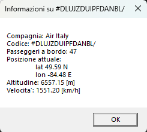

# GestioneAereoporto

Codice scritto nell'inverno 2020 per un compito a casa di Informatica del quarto anno di liceo.

La richiesta era: _Scrivere un programma che generi una serie di aerei con posizioni e numero di passeggeri casuali_. 

Questa soluzione crea una finestra windows e anima il moto degli aerei. Cliccando col tasto sinistro su un aereo si possono vedere le informazioni associate.

